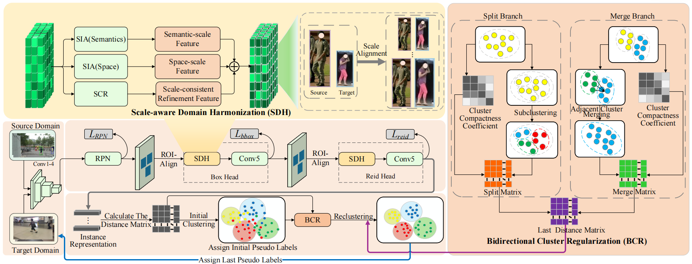

# Domain Adaptive Person Search

## Introduction

This is the official implementation for our paper **Scale-Aware Domain Harmonization for Domain Adaptation Person Search (SCALE)** in ICML2026. The code is based on the official code of [DSCA](https://github.com/whbdmu/DSCA).

|  Source   |  Target   | mAP  | Top-1 |                              CKPT                              |
| :-------: | :-------: | :--: | :---: | :------------------------------------------------------------: |
| CUHK-SYSU |    PRW    | 41.7 | 82.4  | [ckpt](https://drive.google.com/file/d/1LuRwvwWz9zycNBu9b1ZRsVQixVK-3DRN/view?usp=drive_link) |
|    PRW    | CUHK-SYSU | 82.3 | 84.0  | [ckpt](https://drive.google.com/file/d/1C811cD3jZTayhURX3Ma9yJlOLuxWk0id/view?usp=drive_link) |




## Installation

run `python setup.py develop` to enable SPCL

Install Nvidia [Apex](https://github.com/NVIDIA/apex)

Run `pip install -r requirements.txt` in the root directory of the project.

## Data Preparation

1. Download [CUHK-SYSU](https://drive.google.com/open?id=1z3LsFrJTUeEX3-XjSEJMOBrslxD2T5af) and [PRW](https://goo.gl/2SNesA) datasets, and unzip them.
2. Modify `DATA_ROOT` and `TDATA_ROOT` in `configs/cuhk_sysu_da.yaml` and `configs/prw_da.yaml` to your own dataset path.

## Testing

1. Following the link in the above table, download our pretrained model to anywhere you like

2. Evaluate its performance by specifing the paths of checkpoint and corresponding configuration file.

PRW as the target domain:

```
python train.py --cfg configs/cuhk_sysu_da.yaml --eval --ckpt $MODEL_PATH
```

CUHK-SYSU as the target domain:

```
python train.py --cfg configs/prw_da.yaml --eval --ckpt $MODEL_PATH
```

## Training

PRW as the target domain:

```
python train.py --cfg configs/cuhk_sysu_da.yaml
```

CUHK-SYSU as the target domain:

```
python train.py --cfg configs/prw_da.yaml
```

